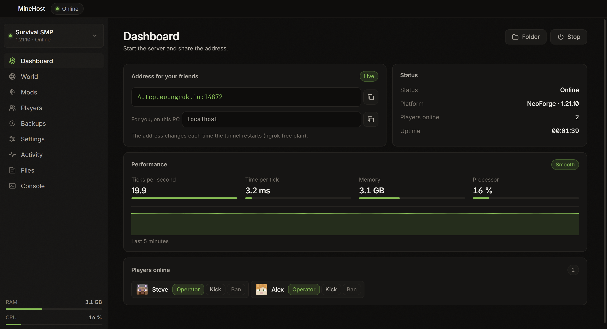
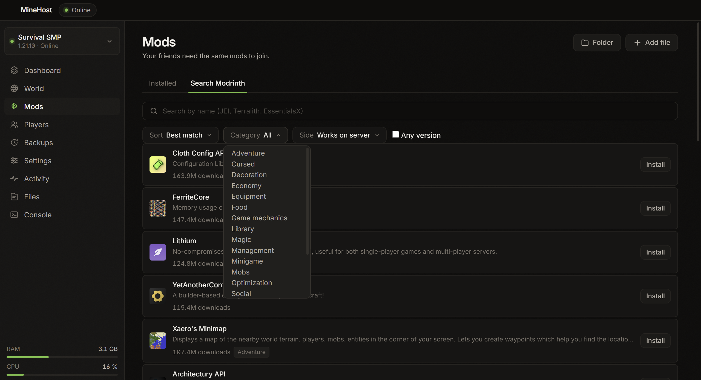
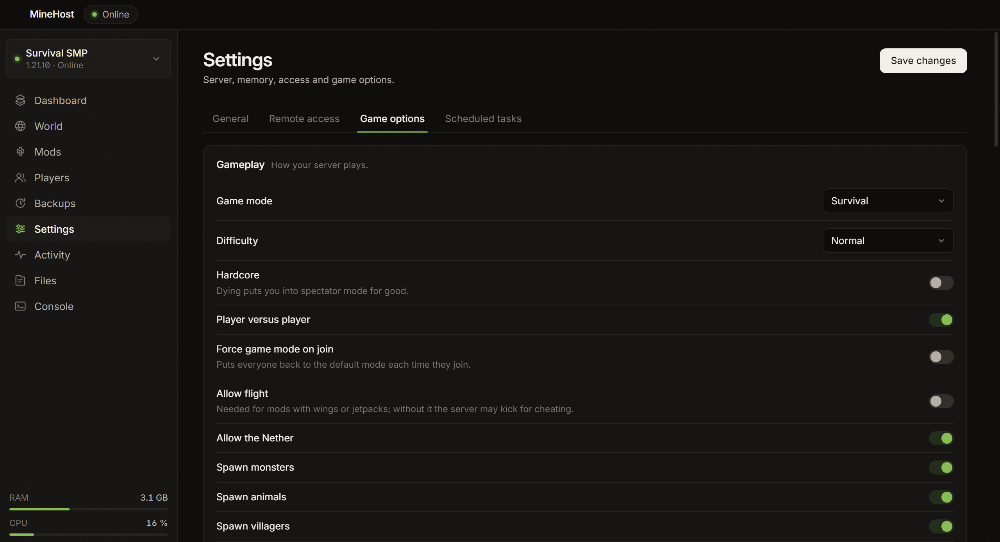
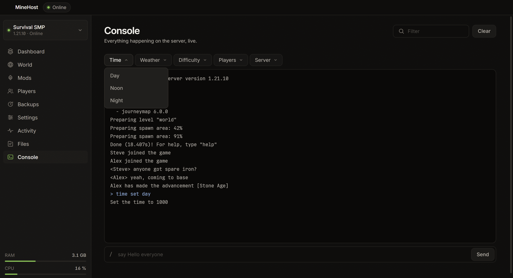
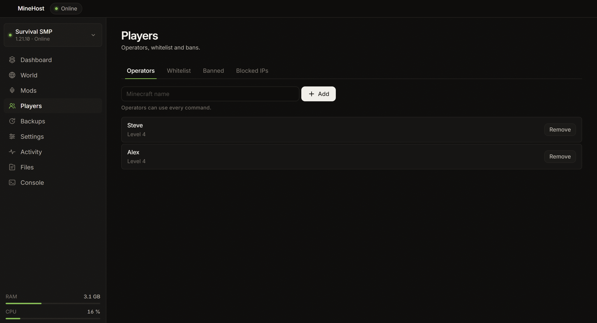
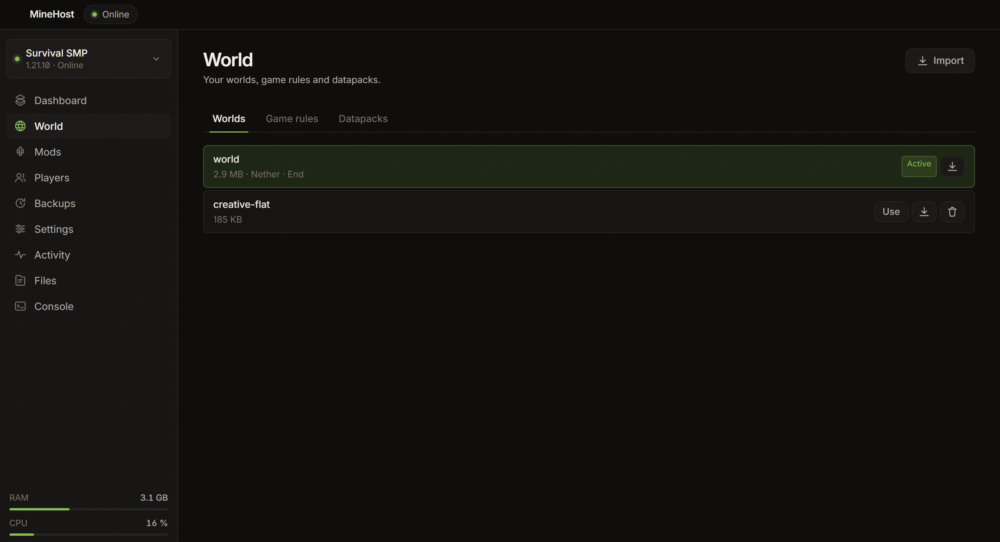
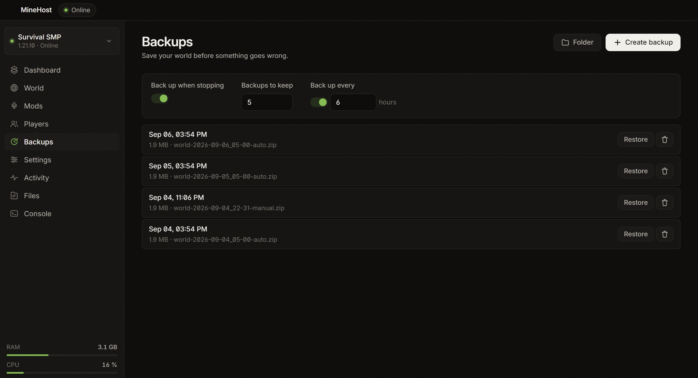

<div align="center">

# MineHost

**An Aternos-style panel, except the server runs on your own PC.**

Install, configure and share a Minecraft server without touching the router, without a terminal, and without hand-editing config files.



</div>

---

## What it does

Aternos is convenient, but there are queues, capped RAM, and your world lives on somebody else's machine. Running a server at home gives better performance and full control, at the cost of installers, JVM arguments, `server.properties` and port forwarding — which is often impossible on routers you don't control or under carrier-grade NAT. MineHost fills that gap: your hardware and your worlds, with the convenience of a hosted panel.

## Features

- **Automatic installation** — pick a platform and version, MineHost downloads the server, installs it and accepts the EULA; if the right Java version is missing it fetches a private copy, leaving your system Java alone
- **Six platforms** — NeoForge, Forge, Fabric, Paper, Purpur and Vanilla, with a note on whether friends will need to install mods
- **Mods and plugins** — a built-in Modrinth browser with filters by category, sort order and side, automatic dependency resolution and SHA-1 verification, or drag in your own `.jar` files
- **Worlds** — multiple worlds in the same folder, switching the active one, importing/exporting `.zip` archives, and resetting the Nether or the End independently
- **Players** — operators, whitelist, bans and blocked IPs, applied live by command or by editing JSON files when stopped; names resolved against Mojang with player faces shown
- **Backups** — manual, automatic on shutdown, or on a schedule, with rotation; runs `save-off` / `save-all flush` so a world is never captured mid-write, and restoring moves the current world aside rather than deleting it
- **Visual settings** — all 43 `server.properties` options and 28 game rules, grouped and explained in plain language, in every supported language
- **Live console** — a filterable, level-coloured log, a command box, and dropdown shortcuts for time, weather, difficulty, teleporting, game modes and announcements
- **Access from outside** — a built-in ngrok tunnel that downloads the binary, stores your authtoken and publishes a shareable address; port forwarding and LAN-only are supported too
- **Watching** — live RAM/CPU monitoring, automatic restart on crash, and scheduled restarts that warn players in chat first
- **Seven languages** — English, Spanish, Portuguese, French, German, Italian and Russian, including every settings caption

### What it looks like

<table>
<tr>
<td width="50%">

**Mods, from Modrinth**



Search, filter and install with dependencies resolved for you.

</td>
<td width="50%">

**Every setting, explained**



All 43 properties and 28 game rules, in your language.

</td>
</tr>
<tr>
<td width="50%">

**Live console**



Shortcuts for the commands you actually use.

</td>
<td width="50%">

**Players**



Operators, whitelist and bans, one click each.

</td>
</tr>
<tr>
<td width="50%">

**Worlds**



Several worlds, imported and exported as .zip files.

</td>
<td width="50%">

**Backups**



Automatic, rotated, and flushed safely before copying.

</td>
</tr>
</table>

## Installation / Usage

### Installing

1. Download the installer from [Releases](../../releases).
2. Run `MineHost Setup 1.5.2.exe`.
3. Open it from the Start menu.

Windows will warn about an unknown publisher: the executable is not signed, because a certificate costs money. Click **More info › Run anyway**.

> **Antivirus:** MineHost downloads `ngrok.exe` for the tunnel. Some antivirus products flag it out of caution, because malicious software uses tunnelling too. If Windows Defender blocks it, add an exclusion for `%USERPROFILE%\.minehost`.

### Getting started

The first time you open it, a three-step wizard asks where to keep the server, which platform you want and which version. When it finishes, a guided tour points out the four things that matter.

For people to join from outside your network you need a free ngrok account: the app takes you to the page, you paste the authtoken, and that is it. Ngrok asks for card verification to enable TCP tunnels on the free plan — that is their anti-abuse requirement, and it does not charge you.

Once the server is up:
- **You**, on this same PC, connect to `localhost`.
- **Your friends** use the address shown in the panel.

### FAQ

**Is my PC the server, or is ngrok?**
Your PC. Ngrok is only a bridge that lets traffic in from the internet. Turn the PC off and the server goes down.

**Does the address change?**
Yes. On ngrok's free plan it changes every time the tunnel restarts.

**Can I use my existing world?**
Yes. Export your `world` folder as a `.zip` and import it from the World tab.

**Why won't it start with certain mods?**
Client-only mods (Sodium, Iris, minimaps) do not work on a dedicated server and some of them stop it booting. The browser marks these as "Client only", and the side filter hides them by default; disable any you already installed from the Mods tab.

**How much RAM should I give it?**
With around 40 mods, 6–8 GB is plenty. Always leave 2 GB for Windows.

**Do I need Java?**
No. If it is missing, MineHost installs the right version under `%USERPROFILE%\.minehost\java`.

### Requirements

- Windows 10 or later (64-bit)
- 4 GB of free RAM minimum, 8 GB recommended with mods
- An internet connection for the initial install

### Development

```bash
git clone https://github.com/<user>/MineHost.git
cd MineHost
npm install
npm start        # development mode
npm run dist     # builds the installer into release/
```

### Layout

```
src/
  main/                      main process
    main.js                    entry point: managers, window, IPC
    context.js                 shared state and the operations on it
    window.js                  the application window
    ipc/                       one module per channel group
      index.js                   loads them all
      shared.js                  helpers more than one of them needs
      server.js, worlds.js, mods.js, players.js, …
    server/                    pieces of the server lifecycle
      logPatterns.js             turning console output into facts
      jvmFlags.js                Aikar's G1GC tuning
      statsMonitor.js            RAM and CPU sampling
    serverManager.js           process lifecycle and console
    platforms.js               the six platforms and their APIs
    installer.js               Java and server downloads
    ngrokManager.js            tunnel and authtoken
    playerManager.js           ops, whitelist and bans
    backupManager.js           safe-flush backups with rotation
    worldManager.js            worlds: import, export, reset dimensions
    modrinth.js                search and install with dependencies
    scheduler.js               scheduled restarts and backups
    catalog.js                 properties and game rules, as i18n keys
    settings.js                persisted configuration
    preload.js                 the isolated bridge to the interface
  renderer/                  interface, no frameworks
    app.js                     entry point and first load
    icons.svg                  the icon sprite
    core/                      dom.js, i18n.js
    ui/                        feedback.js, navigation.js
    features/                  one module per screen
    onboarding/                wizard.js, tour.js
    styles/                    base/, components/, features/
  i18n/                      seven language files
assets/
  fonts/                     Inter and JetBrains Mono (SIL OFL)
  make-icon.js               builds the icon with no dependencies
```

### Design notes

Depth is built from a ladder of surfaces and 1px rules; there is not a single shadow anywhere. Green is reserved for server state, so the primary button is light-on-dark instead. Numbers use tabular figures so they do not jitter as they update, and everything honours `prefers-reduced-motion`.

Text the user can read never lives in the code. The backend returns error codes and i18n keys, resolved against the active language on the way out — which is why the settings catalogue reads naturally in all seven languages rather than only the one it was written in.

## Tech stack

- Electron
- Node.js
- adm-zip
- electron-builder (NSIS packaging)
- Inter and JetBrains Mono (SIL OFL)

## License

MIT — see [LICENSE](LICENSE). The bundled typefaces are distributed under the SIL Open Font License.

MineHost is not affiliated with Mojang, Microsoft, NeoForged, PaperMC, Modrinth or ngrok. Minecraft is a trademark of Mojang AB.
